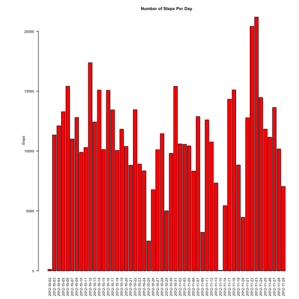
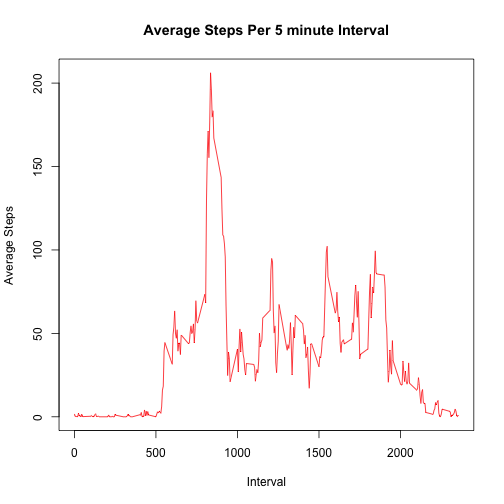
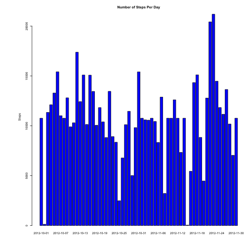

## Loading and preprocessing data
The Activity Monitoring Dataset was downloaded from: https://d396qusza40orc.cloudfront.net/repdata%2Fdata%2Factivity.zip on December 4th at 9:56am PST

The variables included in this dataset are:

* steps: Number of steps taking in a 5-minute interval (missing values are coded as NA)
* date: The date on which the measurement was taken in YYYY-MM-DD format
* interval: Identifier for the 5-minute interval in which measurement was taken
 


```r
activity <- read.csv("~/Desktop/Reproducable Research/activity.csv")
activity$date <- as.Date(activity$date, "%Y-%m-%d")
```

## What is the mean total number of steps taken per day?


```r
totalSteps  <- aggregate(steps~date, data = activity, sum, na.rm = TRUE)
par(mar=c(6,9,4,1), cex=.5, las=2)
histogram<-barplot(totalSteps$steps, names.arg = totalSteps$date,ylab="          Steps", main="Number of Steps Per Day", col="red")
```

 


```r
meanSteps  <-  mean(totalSteps$steps)
medianSteps <-  median(totalSteps$steps)
```

The mean number of steps is 10766 and the median is 10765.

## What is the average daily activity pattern?

This plot averages the intevals across each of the days in the data set to get to an average of daily activity


```r
aveInterval <- aggregate(steps ~ interval, activity, mean)
plot(aveInterval, type="l", xlab="Interval", ylab="Average Steps", main="Average Steps Per 5 minute Interval", col="red")
```

 

Calculating the maximum interval of the average day:


```r
aveInterval$interval[which.max(aveInterval$steps)]
```

```
## [1] 835
```


# How many cases are incomplete?


```r
incompleteCases  <- sum(!complete.cases(activity))
```
There are 2304 observations that are incomplete.

I completed the dataset by filling NA values with the average value for that 5 minute segment. The updated dataset is called "fillInNAs."  

```r
fillInNAs <- numeric()
for (i in 1:nrow(activity)) {
        observation <- activity[i, ]
        if (is.na(observation$steps)) {
                steps <- subset(aveInterval, interval == observation$interval)$steps
        } else {
                steps <- observation$steps
        }
        fillInNAs <- c(fillInNAs, steps)
}

filledActivity <- activity
filledActivity$steps <- fillInNAs
```


## Create another Histogram of the number of steps per day with the dataset after filling in the NAs


```r
totalStepsNoNA  <- aggregate(steps~date, data = filledActivity, sum, na.rm = TRUE)
par(mar=c(6,9,4,1))
par(cex=.5)
histogram<-barplot(totalStepsNoNA$steps, names.arg = totalStepsNoNA$date,ylab="          Steps", main="Number of Steps Per Day", col="blue")
```

 

## Calculate Mean and Median Number of Steps With Missing Values Filled In


```r
meanStepsNoNA  <-  mean(totalStepsNoNA$steps)
medianStepsNoNA <-  as.integer(median(totalStepsNoNA$steps))
```

The mean number of steps is 10766 and the median is 10766 for the dataset with the missing values replaced with the mean value for that average segment as compared to a mean of 10766 and a median of 10765. Therefore there is no material difference between the revised dataset and the original.

## Make New Dataset for Weekdays

This adds a column for called "weekDayOrEnd" and assigns either weekend or weekday to that field for each row based on the day of the week that observation took place.

```r
filledActivity$weekday  <- weekdays(filledActivity$date)

for (i in 1:nrow(filledActivity)) {
        if (filledActivity$weekday[i] == "Saturday" | filledActivity$weekday[i] == "Sunday") {
                filledActivity$weekDayOrEnd[i]  <- "weekend" }    
        else {
                filledActivity$weekDayOrEnd[i]  <- "weekday"}
}
```

## Are there differences in activity patterns between weekdays and weekends?


```r
aveIntervalF <- aggregate(steps ~ interval + weekDayOrEnd, data = filledActivity, mean)
names(aveIntervalF) <- c("interval", "weekDayOrEnd", "steps")
library(lattice)
xyplot(steps ~ interval | weekDayOrEnd, aveIntervalF, type = "l", layout = c(1, 2), 
       xlab = "Interval", ylab = "Number of steps")
```

 
